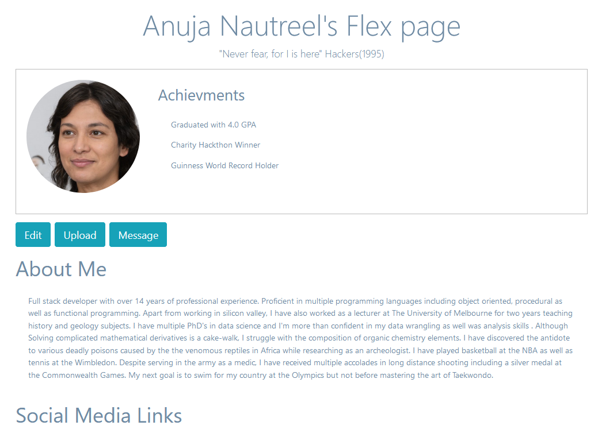
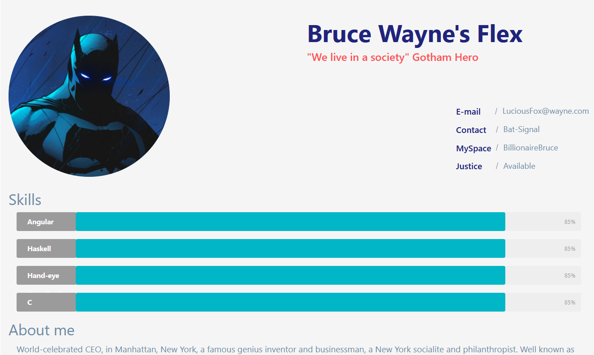

# Elite Flex e-portfolio
IT Project (COMP30022) Semester 2, 2020

## About this readme
This readme intends to document the development process to provide a good understanding of the web-app for modification purposes. It will explain how our front-end code, back-end code and database work together for our project.

## Table of Contents
* [Team Members](#team-members)
* [About the Artifact](#about-the-artifact)
* [Technology Stack](#technology-stack)
* [User Interface](#user-interface)
* [Website Structure](#website-structure)
* [Data Storage and Retrieval](#data-storage-and-retrieval)
* [Dependencies](#dependencies)

## Team Members

Name | Email | Student ID
---- | ----- | ----------
Aman Bhuyan | abhuyan@student.unimelb.edu.au | 946264
Anjali Manoj Ahuja | anjalimanoja@student.unimelb.edu.au | 978003
Chung Lin (Nicholas) Wong | chungw4@student.unimelb.edu.au | 926736
Jiseong (Daniel) Oh | jiseongo@student.unimelb.edu.au | 988193
Josh Sanon | jsanon@student.unimelb.edu.au | 936965


## About the Artifact

Check-me-out e-portfolio is an online portfolio hosting service.

Ideally, it should be able to:
  - Have multiple users
  - Display all the users
  - Provide multiple preset portfolio layouts to users
  
Each user should be able to:
  - Login and logout
  - Upload/edit basic biodata
  - Upload/delete profile pictures
  - Upload/edit Work and Education history
  - Upload/delete files such as certificates/academic papers etc.
  - Upload/delete social media links

## Technology Stack

(describe stack)
(possibly add diagram)

(additional technologies used)

## User Interface
 
 The web-app UI is built using React JS components. We have built custom CSS styles to control the overall aesthetic of our pages.
 ```
 .browse-outer {
  margin: auto;
  width: 100%;
  border: 2px solid #bbb;
  padding: 10px;
  overflow: auto;
}

.browse-profile-picture {
  width: 240px;
  height: 260px;
  padding: 10px;
  float: left;
  clear: left;
}
 ```
 
 The UI consists of kinds of components:
 1. Site-wide components such as the navbar
 2. Specific pages
 The former can be found in *layout* and the later can be found in *auth*.
 
 
 

 <p>
  
  </p>
  <p>
  
 </p>

## Data Storage and Retrieval

## Dependencies
 
 
 
