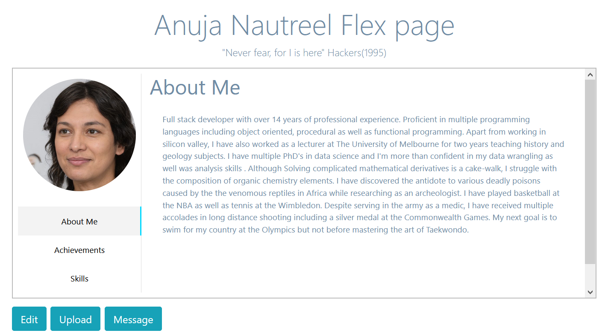

# Elite Flex e-portfolio
IT Project (COMP30022) Semester 2, 2020

## About this readme
This readme intends to document the development process to provide a good understanding of the web-app for modification purposes. It will explain how our front-end code, back-end code and database work together for our project.

## Table of Contents
* [Team Members](#team-members)
* [About the Artifact](#about-the-artifact)
* [Technology Stack](#technology Stack)
* [User Interface](#user-interface)
* [Data Storage and Retrieval](#data-storage-and-retrieval)

## Team Members

Name | Email | Student ID
---- | ----- | ----------
Aman Bhuyan | abhuyan@student.unimelb.edu.au | 946264
Anjali Manoj Ahuja | anjalimanoja@student.unimelb.edu.au | 978003
Chung Lin (Nicholas) Wong | chungw4@student.unimelb.edu.au | 926736
Jiseong (Daniel) Oh | jiseongo@student.unimelb.edu.au | 988193
Josh Sanon | jsanon@student.unimelb.edu.au | 936965

## About the Artifact

Check-me-out e-portfolio is an online portfolio hosting service.

Ideally, it should be able to:
  - Have multiple users
  - Display all the users
  - Provide multiple preset portfolio layouts to users
  
Each user should be able to:
  - Login and logout
  - Upload/edit basic biodata
  - Upload/delete profile pictures
  - Upload/edit Work and Education history
  - Upload/delete files such as certificates/academic papers etc.
  - Upload/delete social media links
  
 ## User Interface
 
 The web-app UI is built from React JS components and can be divided into two parts, site-wide components such as the navbar and page-specific components for each page.
 
 The react components are arranged on the page using custom CSS. 
 

  
  
 

 
 
 This way we have set up preset Layouts for the clients to select.
 

  
  

  

  
 

## Data Storage and Retrieval
 
 
 
